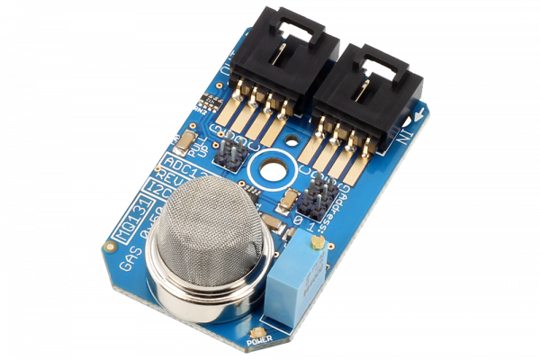

# ADC121C_MQ131

The MQ131 ozone gas sensor is capable of sensing ozone air concentration levels between 10ppb and 2ppm. The ideal sensing condition for the MQ131 is 20°C ±2°C at 65% ±5% humidity.
This Device is available from www.ncd.io 

[SKU: ADC121C_MQ131_I2CS]

(https://store.ncd.io/product/mq131-ozone-gas-sensor-adc121c-12-bit-adc-i%C2%B2c-mini-module/)
This Sample code can be used with Arduino.

Hardware needed to interface ADC121C_MQ131 ozone gas detection Sensor with Arduino
1. <a href="https://store.ncd.io/product/i2c-shield-for-arduino-nano/">Arduino Nano</a>
2. <a href="https://store.ncd.io/product/i2c-shield-for-arduino-micro-with-i2c-expansion-port/">Arduino Micro</a>
3. <a href="https://store.ncd.io/product/i2c-shield-for-arduino-uno/">Arduino uno</a>
4. <a href="https://store.ncd.io/product/dual-i2c-shield-for-arduino-due-with-modular-communications-interface/">Arduino Due</a>
5. <a href="https://store.ncd.io/product/mq131-ozone-gas-sensor-adc121c-12-bit-adc-i%C2%B2c-mini-module/">ADC121C_MQ131 ozone gas detection Sensor</a>
6. <a href="https://store.ncd.io/product/i%C2%B2c-cable/">I2C Cable</a>

ADC121C_MQ131:

The MQ131 ozone gas sensor is capable of sensing ozone air concentration levels between 10ppb and 2ppm. The ideal sensing condition for the MQ131 is 20°C ±2°C at 65% ±5% humidity.

Applications:

•They are used in air quality control equipments for buildings/offices, are suitable for detecting Of O3 .

How to Use the ADC121C_MQ131 Arduino Library

The ADC121C_MQ131 has a number of settings, which can be configured based on user requirements.

1.Automatic Conversion mode: When these bits are set to zeros, the automatic conversion mode is disabled. This is the case at power-up.When these bits are set to a non-zero value, the ADC will begin operating in automatic conversion mode.

           mq131.setCycleTime(CYCLE_TIME_32);                    // Tconvert x 32, 27 ksps
    
2.Alert Hold:This bit tells the Alert will self clear or not.

   0: Alerts will self-clear when the measured voltage moves within the limits by more than the hysteresis register value.
  
   1: Alerts will not self-clear and are only cleared when a one is written to the alert high flag or the alert low flag in the Alert Status register.

            mq131.setAlertHold(ALERT_HOLD_CLEAR);                 // Alerts will self-clear

3.Alert Flag Enable:This bit indicates when an alert condition has occurred. When the Alert Bit Enable is set in the Configuration Register, this bit will be high if either alert flag is set in the Alert Status Register.Otherwise, this bit is a zero.

   0: Disables alert status bit [D15] in the Conversion Result register.
  
   1: Enables alert status bit [D15] in the Conversion Result register.

        mq131.setAlertFlag(ALERT_FLAG_DISABLE);               // Disables alert status bit in the Conversion Result register
       
4.Alert Pin Enable:.

   0: Disables the ALERT output pin. The ALERT output will TRI-STATE when the pin is disabled.
  
   1: Enables the ALERT output pin
  
         mq131.setAlertPin(ALERT_PIN_DISABLE);                 // Disables the ALERT output pin
         
5.Polarity: This bit configures the active level polarity of the ALERT output pin.

   0: Sets the ALERT pin to active low.
 
   1: Sets the ALERT pin to active high
 
         mq131.setPolarity(POLARITY_LOW);                      // Sets the ALERT pin to active low
    
6.Output measurement:The following command is used to measure the concentration of ozone gas.

  1.Ozone gas measurement:The following command is used to measure the LPG gas.
  
         mq131.Measure_Ozone(-0.90, 0.69);
     
 
